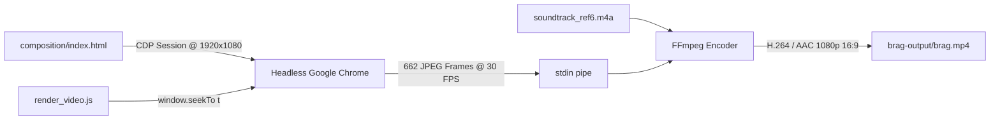

<div align="center">

# 🎬 iWriteTech — High-Velocity Product Launch Film

**A 22.06-second cinema-grade product launch film for [iWriteTech](https://iwritetech.com), engineered with high-octane velocity motion design, 16:9 widescreen studio staging, 3D card fanning, disassembled switch macro photography, massive 80+ specimen mosaic, and deterministic rendering inspired by `reference_video6.mp4`.**

[-gold?style=for-the-badge&logo=youtube&logoColor=white)](brag-output/brag.mp4)
[-black?style=for-the-badge)](brag-output/brag.mp4)
[](brag-output/brag.mp4)
[](brag-output/composition/index.html)
[](brag-output/work/soundtrack_ref6.m4a)
[](https://github.com/latent-spaces/brag)

<br/>

[](brag-output/brag.mp4)

<br/>

**[▶ Watch Video (`brag.mp4`)](brag-output/brag.mp4)** &nbsp;•&nbsp; **[📋 Storyboard Plan](brag-output/brag-plan.md)** &nbsp;•&nbsp; **[🎨 Web Composition](brag-output/composition/index.html)** &nbsp;•&nbsp; **[✍️ Social Copy](brag-output/share-copy.txt)**

</div>

---

## 📖 Overview

**[iWriteTech](https://iwritetech.com)** is an independent technology platform and hardware laboratory dedicated to obsessively tested developer workspaces, mechanical keyboards, studio acoustics, and ergonomic desk architecture.

This production repository contains the full automated pipeline that generated its high-velocity official launch film:
- **16:9 Widescreen Cinema Staging:** Engineered specifically in 1920×1080 Full HD with a floating rounded studio container card (`1560×880px`, `border-radius: 40px`, subtle ambient amber/cyan backglow).
- **High-Velocity Motion Design:** Supersonic speed streaks, 3D card fanning with perspective transforms, kinetic bold italic typography, live numeric telemetry counters, and holographic sparkle annotations.
- **Hardware Disassembly & Refinement:** Extreme macro photography of an artisanal disassembled custom switch with transparent smoky polycarbonate housing, gold spring, and brass contact leaf, accompanied by an interactive cursor click on `[✦ Studio Thock: Active]`.
- **Massive Specimen Mosaic:** An expansive diagonal grid of 80+ curated desk setup photography tiles, ambient monitor lightbars, and artisan keycaps covering the screen.
- **HyperFrames Deterministic 30 FPS Rendering:** Headless Google Chrome evaluates time deterministically via Chrome DevTools Protocol (`window.seekTo(t)`), streaming 662 JPEG frames directly into FFmpeg H.264 at CRF 18 with zero dropped frames or performance stutter.
- **Synchronized Master Soundtrack:** 22.06-second master stereo soundtrack extracted from `reference_video6.mp4` (`soundtrack_ref6.m4a`), precisely locked to rhythm drops, vocal hooks, and climatic brand reveals.

---

## ⏱️ Storyboard & 7-Scene Breakdown (22.06s)

```
[0.00s – 2.20s]  Scene 1: Velocity Intro — "INTRODUCING: THE SANCTUARY PROTOCOL"
[2.20s – 5.50s]  Scene 2: 3D Hardware Fan — "SANCTUARY PROTOCOL: THE MOST REFINED"
[5.50s – 9.00s]  Scene 3: Metric Velocity — "BENCHMARK IN 1.3 SEC (0240+ Setups)"
[9.00s – 12.50s] Scene 4: Cost Disruption — "FOR A FRACTION OF THE COST"
[12.50s – 16.50s] Scene 5: Pro Calibration — "REFINE TO PRO QUALITY (Switch Macro & Cursor Click)"
[16.50s – 19.80s] Scene 6: Massive Specimen Mosaic — "BUILD AS FAST AS YOU DREAM"
[19.80s – 22.06s] Scene 7: Chromatic Glitch & Brand Finale — "iWriteTech (Build your sanctuary.)"
```

| Timestamp | Scene | Visual Mechanics & Choreography | Sound & Rhythmic Sync |
|---|---|---|---|
| **0.00s – 2.20s** | **Scene 1: Velocity Intro** | High-velocity camera zoom into custom matte black 65% CNC keyboard chassis with luminous amber and cyan speed streaks. Massive bold italic type: `INTRODUCING` with telemetry badge: `[0.12ms LATENCY · 8,000Hz POLLING]`. | High-energy driving electronic opener with rising frequency whoosh. |
| **2.20s – 5.50s** | **Scene 2: 3D Hardware Fan** | Dynamic 3D fan of verified hardware specimen cards whipping into perspective with motion blur: `SANCTUARY PROTOCOL` → `THE MOST REFINED ON THE MARKET`. | Punchy drum break and energetic synth bass. |
| **5.50s – 9.00s** | **Scene 3: Metric Velocity** | Rocketing acoustic frequency curve soaring upward with an animated numeric counter ticking to `0240+ SPECIMENS BENCHMARKED` and real-time sound resonance locking to `42.8 dB SPL`. | Sharp electronic rhythm and rising vocal cue. |
| **9.00s – 12.50s** | **Scene 4: Cost Disruption** | High-contrast hardware comparison stack (`$850 Curated Sanctuary vs $3,200 Hype Tax`) with shuffling specimen cards and badges: `ZERO AFFILIATE NOISE · 100% INDEPENDENT LAB`. | Fast syncopated percussion. |
| **12.50s – 16.50s** | **Scene 5: Pro Calibration** | Macro photography of an artisanal disassembled mechanical switch with holographic sparkles and an animated OS cursor clicking `[✦ Studio Thock: Active]`. | Mid-tempo percussive groove and crisp click sound sync. |
| **16.50s – 19.80s** | **Scene 6: Massive Specimen Mosaic** | Single hardware card explodes outward into a dynamic diagonal mosaic of 80+ curated desk setup photography tiles: `BUILD AS FAST AS YOU DREAM`. | Driving crescendo with wide synth wash. |
| **19.80s – 22.06s** | **Scene 7: Chromatic Brand Finale** | Chromatic aberration RGB-split glitch transition into the clean studio card with precision squircle logo emblem (glowing amber dot), bold custom wordmark: **iWriteTech**, and punchline: `Build your sanctuary.` | Final chord strike and resolving electronic reverb. |

---

## 🎨 Visual System & Tokens

- **Typography:**
  - Headline Font: [Space Grotesk](https://fonts.google.com/specimen/Space+Grotesk) (heavy italic weights 700, 800, 900)
  - Brand Wordmark: [Outfit](https://fonts.google.com/specimen/Outfit) (weight 900)
  - Telemetry / Labels: [JetBrains Mono](https://www.jetbrains.com/lp/mono/)
- **Palette (16:9 Cinema Studio Theme):**
  - Background Canvas: `#07080B` (Deepest Obsidian with 60px coordinate grid)
  - Studio Card Surface: `#0E1015` / `#E8ECEF`
  - Primary Accent: `#FF5E36` / `#FFA048` (Luminous Amber / Solar Orange)
  - Secondary Neon: `#00F0FF` (Cyan speed streaks)
  - Verified Green: `#10B981` (Zero affiliate bias, active calibrations)
- **Engine:**
  - 100% Deterministic HTML5 Canvas 2D + SVG + CSS transforms driven by `window.seekTo(t)`.
  - Zero non-deterministic random state.

---

## ⚙️ Automated Rendering Pipeline



### Reproducing the Render Locally

```bash
# 1. Test preview snapshots across all 7 scenes
node brag-output/test_preview.js

# 2. Render the full cinema-grade 16:9 video (662 frames @ 30fps)
node brag-output/render_video.js
```
