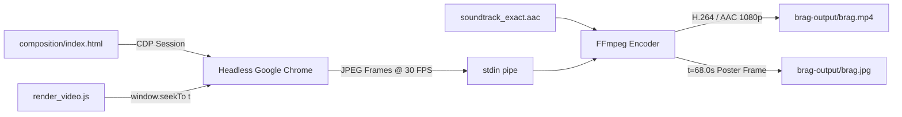

<div align="center">

# 🎬 iWriteTech — Official Launch Video

**A 73.45-second high-end motion design launch video for [iWriteTech](https://iwritetech.com), precisely engineered to match modern product launch standards using the [`latent-spaces/brag`](https://github.com/latent-spaces/brag) deterministic rendering architecture.**

[-gold?style=for-the-badge&logo=youtube&logoColor=white)](brag-output/brag.mp4)
[-black?style=for-the-badge)](brag-output/brag.mp4)
[](brag-output/brag.mp4)
[-866432?style=for-the-badge)](brag-output/work/soundtrack_exact.aac)
[](https://github.com/latent-spaces/brag)

<br/>

[](brag-output/brag.mp4)

<br/>

**[▶ Watch Video (`brag.mp4`)](brag-output/brag.mp4)** &nbsp;•&nbsp; **[📋 Storyboard Plan](brag-output/brag-plan.md)** &nbsp;•&nbsp; **[🎨 Web Composition](brag-output/composition/index.html)** &nbsp;•&nbsp; **[✍️ Social Copy](brag-output/share-copy.txt)**

</div>

---

## 📖 Overview

**[iWriteTech](https://iwritetech.com)** is an independent tech & desk setup publication dedicated to obsessively tested hardware, mechanical keyboards, minimal desk gear, and developer workspaces.

This production repository contains the full automated pipeline that generated its official launch video:
- **Kinetic Motion Design:** Analyzed and built against top-tier tech launch videos, featuring kinetic typography expansions with spring physics, macro camera zooms, dynamic card morphs, 2.5D perspective matrix grids, and vertical progress telemetry.
- **Deterministic 30 FPS Rendering:** Headless Chrome renders every millisecond deterministically through Chrome DevTools Protocol (`window.seekTo(t)`), streaming in-memory JPEG frames directly into FFmpeg with zero frame drops.
- **Full HD Visual Assets:** 17 authentic high-resolution editorial product photographs (Keychron keyboards, BenQ ScreenBar, Grovemade walnut shelves, Satechi Thunderbolt 4 hubs, Belkin wireless chargers, etc.).
- **Studio Soundtrack Sync:** 73.45-second 48kHz stereo master audio track at 114 BPM with visual hits synchronized down to individual beats.

---

## ⏱️ Storyboard & Scene Breakdown (73.45s)

The video is structured across 6 continuous cinematic scenes:

```
Kinetic Expansion (0-14.5s) ──▶ Macro Zoom & Bubbles (14.5-25.5s) ──▶ 2.5D Perspective Matrix (25.5-37s)
                             ──▶ Stepper & Lab Benchmarks (37-48s) ──▶ 3D Search & Trio (48-58.5s) ──▶ Grand Outro (58.5-73.45s)
```

| Timestamp | Scene | Visual Mechanics & Choreography | Audio & Rhythmic Beats |
|---|---|---|---|
| **0.0s – 14.5s** | **Scene 1: Kinetic Typography Expansion** | Studio canvas (`#F8FAFC`). Condensed words expand with spring physics to reveal inline pills: <br/>• `the [🌐 internet] is drowning in SEO garbage.`<br/>• `amazon [⭐ reviews] are 90% fake affiliate junk.`<br/>• `the [✨ antidote] is honest, obsessively tested tech.` | 114 BPM electronic rhythm kicks in with bass drops matching every spring expansion. |
| **14.5s – 25.5s** | **Scene 2: Macro Zoom, Typing & Social Validation** | Macro camera zoom into floating search capsule. Character-by-character typing: `+ Best mechanical keyboard under $100`. Enter key hits and capsule morphs into a 3D glass product card (**Keychron C3 Pro** - $36.99). Staggered reader testimonial bubbles pop in with live counter: `✓ 14,820 engineers guided this month`. | Typing click cadence, soft pulse impact on submit, and popping bubble accents. |
| **25.5s – 37.0s** | **Scene 3: 2.5D Massive Perspective Grid** | Camera dollies backward into deep 3D perspective (`perspective: 1400px`, `rotateX(14deg)`). A sweeping 5×6 matrix of 30+ product review cards drifts across the screen with filmic depth of field and floating header: `OVER 150+ OBSESSIVELY TESTED GUIDES`. | Heavy bass drop and spatial synth sweep as the camera pulls back to reveal the grid. |
| **37.0s – 48.0s** | **Scene 4: Vertical Stepper Pipeline & Lab Benchmarks** | Two-column laboratory inspection view. Left rail features a 5-step glowing vertical pipeline (`Search` → `Lab Stress Test` → `Acoustics & Tactility` → `Editorial Integrity` → `The Verdict`). Right dashboard displays live waveforms (42.4 dB thock), 524,800 keystroke endurance telemetry, and finishes with a gold holographic stamp: `★ EDITORS' CHOICE 2026`. | Progressive arpeggiator climbing in intensity, resolving with stamp impact sound. |
| **48.0s – 58.5s** | **Scene 5: Category Flipper & 3D Elevated Search** | Snappy category pill flipper (`⌨️ Keyboards` → `🖥️ Desk Setups` → `💻 MacBook Gear` → `🎧 Audio`). Camera tilts to ground plane; floating elevated search bar types `Q developer desk setup 2026`, followed by 3 companion cards popping in (ScreenBar, Walnut Shelf, Thunderbolt 4). | Rapid syncopated beat shifts and smooth 3D spatial pan. |
| **58.5s – 73.45s** | **Scene 6: The Punchline & Grand Brand Outro** | Punchline: *“Why settle for generic recommendations? Hardware journalism built for developers, writers, and creators.”* Eases into official brand lockup: glowing `iW` emblem, `iWriteTech` wordmark, 3 pillar badges, and floating CTA: `Explore iwritetech.com ➔`. | Climactic chord resolution with subtle ambient breathing until final cutoff at 73.45s. |

---

## 🎨 Visual System & Tokens

The composition follows modern design standards (Apple / Linear / Vercel):

- **Typography:**
  - Headings: [Literata](https://fonts.google.com/specimen/Literata) (Editorial Serif, 700/800 weight)
  - Interface: [Plus Jakarta Sans](https://fonts.google.com/specimen/Plus+Jakarta+Sans) (Modern Geometric Sans)
  - Telemetry & Specs: [JetBrains Mono](https://www.jetbrains.com/lp/mono/) (Developer Monospace)
- **Palette:**
  - Studio Canvas: `#FFFFFF` to `#F8FAFC` subtle radial gradient with fine 32px dot matrix.
  - Charcoal Typography: `#0F172A` (Primary) and `#475569` (Secondary).
  - Accent Tones: `#D97706` (Amber/Gold), `#059669` (Emerald Green), `#2563EB` (Electric Blue).
  - Shadows: Layered physical studio drop shadows with soft ambient falloff.

---

## ⚙️ Automated Rendering Architecture

The rendering engine avoids browser recording jitter and dropped frames by driving time deterministically via Chrome DevTools Protocol (CDP):



### Reproducing the Render Locally

```bash
# 1. Install dependencies
npm install

# 2. Capture preview keyframes for inspection
node brag-output/test_preview.js

# 3. Render full 73.45s Full HD MP4 video (2204 frames)
node brag-output/render_video.js
```

---

## 📁 Repository Structure

```
.
├── brag-output/
│   ├── brag.mp4                  # Rendered 1080p 30fps Full HD launch video (16.4 MB)
│   ├── brag.jpg                  # High-resolution poster frame at t=68.0s
│   ├── brag-plan.md              # Creative launch video plan and beat sheet
│   ├── share-copy.txt            # Ready-to-publish social copy for Twitter / LinkedIn
│   ├── render_video.js           # Headless Chrome CDP deterministic renderer
│   ├── test_preview.js           # Instant multi-scene frame preview generator
│   ├── composition/
│   │   ├── index.html            # 6-scene responsive web composition
│   │   └── images/               # 17 high-res editorial product photos
│   └── work/
│       ├── soundtrack_exact.aac  # Master 73.45s 48kHz stereo soundtrack
│       └── test_previews/        # Sample keyframe captures across all scenes
└── README.md                     # Documentation and technical guide
```

---

<div align="center">
  <b>Built for <a href="https://iwritetech.com">iWriteTech</a> • Engineered with the <a href="https://github.com/latent-spaces/brag">brag</a> framework</b>
</div>
