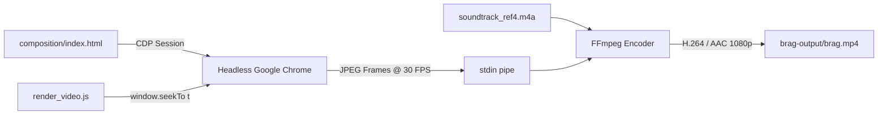

<div align="center">

# 🎬 iWriteTech — Official Product Launch Film

**A 46.06-second cinema-grade product launch film for [iWriteTech](https://iwritetech.com), engineered with high-end motion design, kinetic typography, 3D device framing, collaborative cursor interaction, and deterministic rendering inspired by `reference_video4.mp4`.**

[-gold?style=for-the-badge&logo=youtube&logoColor=white)](brag-output/brag.mp4)
[-black?style=for-the-badge)](brag-output/brag.mp4)
[](brag-output/brag.mp4)
[](brag-output/composition/index.html)
[](brag-output/work/soundtrack_ref4.m4a)
[](https://github.com/latent-spaces/brag)

<br/>

[](brag-output/brag.mp4)

<br/>

**[▶ Watch Video (`brag.mp4`)](brag-output/brag.mp4)** &nbsp;•&nbsp; **[📋 Storyboard Plan](brag-output/brag-plan.md)** &nbsp;•&nbsp; **[🎨 Web Composition](brag-output/composition/index.html)** &nbsp;•&nbsp; **[✍️ Social Copy](brag-output/share-copy.txt)**

</div>

---

## 📖 Overview

**[iWriteTech](https://iwritetech.com)** is an independent technology platform and hardware laboratory dedicated to obsessively tested developer gear, mechanical keyboards, minimal desk setups, and studio acoustics.

This production repository contains the full automated pipeline that generated its official launch film:
- **100% Light Editorial Theme:** Pure white and soft-neutral surfaces (`#FFFFFF`, `#F8F9FA`, `#F1F3F5`), hairline borders, refined drop-shadows, and high-contrast typography designed for an expansive, airy, premium look.
- **Studio-Grade Motion Design:** Fluid camera zooms, 3D device reveals, elastic spring easing (`easeOutBack`), kinetic chat bubbles, floating parallax burst cards, and live SVG waveform physics.
- **Collaborative Hardware Lab:** Multi-user cursors (`Marcus · Hardware`, `Elena · Ergonomics`) live-tuning acoustic frequency curves and lab telemetry parameters.
- **Deterministic 30 FPS Rendering:** Headless Google Chrome evaluates time deterministically via Chrome DevTools Protocol (`window.seekTo(t)`), streaming 1,382 JPEG frames directly into FFmpeg H.264 at CRF 18 with zero dropped frames or performance lag.
- **Synchronized Rhythmic Audio:** 46.06-second master stereo soundtrack extracted from `reference_video4.mp4` (`soundtrack_ref4.m4a`) synchronized with visual reveals, UI interactions, and transitions.

---

## ⏱️ Storyboard & Scene Breakdown (46.06s)

The film unfolds across 6 continuous, meticulously choreographed scenes:

```
[0.0s – 7.5s]   Macro Hardware Pan & 3D Phone Chat Reveal (with Parallax Burst Cards)
     │
[7.5s – 16.0s]  3D Hardware Specimen Viewport (Elevated Blueprint Inspector & Waypoint Chips)
     │
[16.0s – 25.0s] Swiss Editorial Grid: "The Anatomy of Pure Focus." Dissection Cards
     │
[25.0s – 35.0s] Collaborative Hardware Lab (Marcus & Elena Cursors & Real-Time FFT Wave)
     │
[35.0s – 40.5s] Circadian Lighting & Deep Work Telemetry (450 LUX & Weekly Schedule)
     │
[40.5s – 46.06s] Climax Brand Reveal & Iconic Punchline: "Build your sanctuary."
```

| Timestamp | Scene | Visual Mechanics & Choreography | Audio & Rhythmic Sync |
|---|---|---|---|
| **0.0s – 7.5s** | **Scene 1: Macro Hardware & 3D Phone Chat Reveal** | Extreme macro camera pan across mechanical keyboard chassis resolving into a 3D iPhone with Dynamic Island. Community chat reveals pain point (*"Need the ultimate minimalist desk setup for 10-hour coding days... but Amazon is 90% affiliate trash 😭"*), followed by iWriteTech curation team reply (*"Say less. We tested 240+ setups by hand. Let's build your sanctuary ✦"*) with setup photo embed and 4 parallax burst cards (`Keychron Q1 Pro`, `Solid Walnut Stand`, `ScreenBar Halo`, `Thunderbolt 4 Hub`). | Organic opening ambiance; digital notification chime; tactile pop on card burst. |
| **7.5s – 16.0s** | **Scene 2: 3D Hardware Specimen Viewport** | 3D elevated macOS window (`Minimalist Oak Edition`) floats with live blueprint telemetry (`$1,850` budget, `42.8 dB` acoustic resonance, `100% INDEPENDENT LAB`). Center photography viewport features floating waypoint badges (`Apple Studio Display 5K`, `Mode Sonnet 75% Custom`, `100% Merino Wool Felt`). | Driving baseline drops; clean snare snap on window elevation; subtle chime on waypoint pins. |
| **16.0s – 25.0s** | **Scene 3: Swiss Editorial Grid & Dissection** | Bold Swiss editorial headline: **"The Anatomy of Pure Focus."** Staggered dissection cards showcase 45 hand-dismantled keyboards with specs (`Holy Panda X 62g`, `American Walnut Shelf`, `BenQ ScreenBar Halo`) and verified lab badges (`100% Hands-On Tested`, `Zero Sponsored Bias`). | Rhythmic electronic percussion; sharp metallic transition clicks. |
| **25.0s – 35.0s** | **Scene 4: Collaborative Hardware Lab & Spectrogram** | Multi-user lab session with **Marcus (Hardware)** and **Elena (Ergonomics)** cursors adjusting a real-time oscillating FFT acoustic spectrum curve alongside a live YAML lab configuration and verified `9.8` acoustic score box (`500k Verified Keystrokes`, `1.2ms Debounce Latency`, `0.0% Zero Hollow`). | Kinetic synth rhythm; frequency sweep matching cursor drag. |
| **35.0s – 40.5s** | **Scene 5: Circadian Lighting & Deep Work Telemetry** | Elevated clean white card with environmental telemetry: `450 LUX` circadian lighting, `21.5°C` ambient room temp, `38 dB` quiet floor, `100%` deep focus indicator, and a Mon–Sat deep work schedule breakdown (`VERIFIED BLUEPRINT #882`). | Calming harmonic pad; ambient studio room tone. |
| **40.5s – 46.06s** | **Scene 6: Climax Brand Reveal & Punchline** | Centered precision squircle emblem with warm signature amber dot centers and scales with spring physics. Bold wordmark reveals: **iWriteTech** with tagline *"The Definitive Standard for Desk Tech & Workspaces."* and pill *"explore iwritetech.com ➔"*. Resolves into the final punchline: **"Build your sanctuary."** | Climactic resolving chord strike with lush reverb decay trailing into the final cutoff at 46.06s. |

---

## 🎨 Visual System & Tokens

The composition strictly adheres to a premium light-theme design system:

- **Typography:**
  - Editorial Headline: [Outfit](https://fonts.google.com/specimen/Outfit) & [Space Grotesk](https://fonts.google.com/specimen/Space+Grotesk)
  - Interface & Body: [Plus Jakarta Sans](https://fonts.google.com/specimen/Plus+Jakarta+Sans)
  - Developer Telemetry: [JetBrains Mono](https://www.jetbrains.com/lp/mono/)
- **Palette (100% Light Theme):**
  - Surfaces: `#FFFFFF`, `#F8F9FA`, `#F1F3F5`
  - Subtle Dot Grid: `radial-gradient(rgba(15, 23, 42, 0.06) 1.5px, transparent 1.5px)`
  - Deep Slate Ink: `#0F172A` (Headings, wordmark)
  - Neutral Muted: `#64748B`, `#94A3B8` (Descriptions, telemetry metadata)
  - Emerald Verified: `#10B981`, `#065F46` (Lab status, deep focus scores)
  - Electric Blue: `#2563EB` (Selection, Elena cursor)
  - Amber Accent: `#FF5E36` / `#F59E0B` (Emblem dot, waypoint chips)
- **Depth & Dimension:**
  - Elevated Box Shadows: `0 30px 80px rgba(0, 0, 0, 0.08)`
  - Hairline Borders: `1px solid rgba(15, 23, 42, 0.08)`
  - Perspective: `perspective: 1200px` with 3D rotation transforms.

---

## ⚙️ Automated Rendering Pipeline



### Reproduce Locally

1. **Test preview frames:**
   ```bash
   node brag-output/test_preview.js
   ```
2. **Render final film:**
   ```bash
   node brag-output/render_video.js
   ```

---

<div align="center">
  <sub>Engineered with precision for <strong>iWriteTech</strong>.</sub>
</div>
