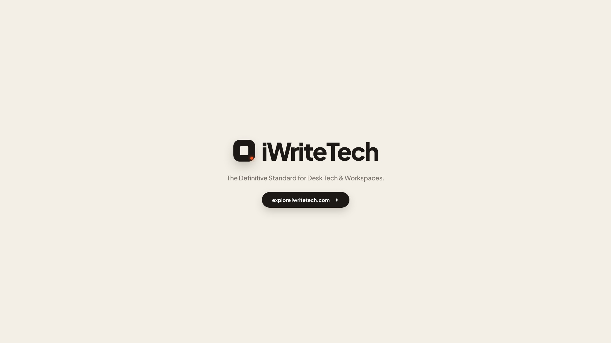
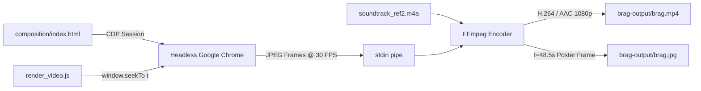

<div align="center">

# 🎬 iWriteTech — Official Product Launch Film

**A 50.13-second cinema-grade product launch video for [iWriteTech](https://iwritetech.com), engineered with high-end motion design, kinetic typography, camera depth, and deterministic rendering inspired by modern technology launch films.**

[-gold?style=for-the-badge&logo=youtube&logoColor=white)](brag-output/brag.mp4)
[-black?style=for-the-badge)](brag-output/brag.mp4)
[](brag-output/brag.mp4)
[](brag-output/work/soundtrack_ref2.m4a)
[](https://github.com/latent-spaces/brag)

<br/>

[](brag-output/brag.mp4)

<br/>

**[▶ Watch Video (`brag.mp4`)](brag-output/brag.mp4)** &nbsp;•&nbsp; **[📋 Storyboard Plan](brag-output/brag-plan.md)** &nbsp;•&nbsp; **[🎨 Web Composition](brag-output/composition/index.html)** &nbsp;•&nbsp; **[✍️ Social Copy](brag-output/share-copy.txt)**

</div>

---

## 📖 Overview

**[iWriteTech](https://iwritetech.com)** is an independent technology platform and hardware laboratory dedicated to obsessively tested developer gear, mechanical keyboards, minimal desk setups, and studio acoustics.

This production repository contains the automated pipeline that generated its official launch film:
- **Studio-Grade Motion Design:** Precision pacing, cubic bezier easing (`cubic-bezier(0.16, 1, 0.3, 1)`), kinetic syntax tokens, velocity blur streaks, multi-plane depth, and responsive cursor physics.
- **Deterministic 30 FPS Rendering:** Headless Google Chrome evaluates time deterministically via Chrome DevTools Protocol (`window.seekTo(t)`), streaming JPEG frames directly into FFmpeg H.264 at CRF 18 with zero frame drops or recording lag.
- **Synchronized Rhythm & Sound:** 50.13-second stereo master soundtrack with visual cuts, kinetic expansions, and sound spectrum analyzers synchronized to individual acoustic beats.
- **Editorial Technology Identity:** Warm cream studio canvas (`#F4EFE6`) transitioning into deep obsidian darkroom (`#0C0D0E`), electric blue (`#2563EB`), and emerald lab accents (`#10B981`).

---

## ⏱️ Storyboard & Scene Breakdown (50.13s)

The film unfolds across 8 continuous, meticulously choreographed scenes:

```
[0.0s - 6.5s] Kinetic Tokens & Brand Manifesto
     │
[6.5s - 14.5s] 3D Floating App Viewport & Sanctuary Gallery
     │
[14.5s - 21.5s] Pill Velocity Streaks & ISO Acoustic Sound Spectrum
     │
[21.5s - 27.5s] Mobile Report Card, Cursor Navigation & CLI Terminal
     │
[27.5s - 35.5s] AI Agent Studio Workspace & Hardware Approval Modal
     │
[35.5s - 42.5s] Thermal Spectral Scan, Diagnostic Check & Shield Matrix
     │
[42.5s - 46.5s] Master Telemetry Dashboard & Verified Lab Counters
     │
[46.5s - 50.13s] Climax Punchline, Brand Emblem & CTA Outro
```

| Timestamp | Scene | Visual Mechanics & Choreography | Audio & Rhythmic Sync |
|---|---|---|---|
| **0.0s – 6.5s** | **Scene 1: Kinetic Tokens & Manifesto** | Warm cream studio canvas (`#F4EFE6`). 5 kinetic code chips (`const stack = await curate();`, `switch: "Tactile 62g"`, `lumens: 450`, `latency: 0.8ms`, `focus: 100%`) drift with spring physics. Pill tag `< DESK INTELLIGENCE >` unlocks centered headline *"engineered for focus."* resolving into the `iWriteTech` emblem. | Ambient synth pad opens; gentle high-hat kicks sync with token reveals. |
| **6.5s – 14.5s** | **Scene 2: Sanctuary Setup Viewport** | Perspective camera tilts into a 3D rounded app window (`box-shadow: 0 40px 100px rgba(0,0,0,0.12)`). Hero photography of a walnut desk setup expands with headline *"Craft your ultimate sanctuary ✦"*. Five sectioned columns (`Custom Keyboards`, `Studio Displays`, `Desk Mat & Oak`, `Thunderbolt Docks`, `Smart Lighting`) glide with staggered entrance. | Driving baseline enters; snare snaps on column slide-ins. |
| **14.5s – 21.5s** | **Scene 3: Acoustic Lab & Frequency Spectrum** | Two dynamic pills (`[ Hardware Lab ] ⚡ [ Sound Spectrum ]`) streak across the screen with directional velocity blur. Snaps into live ISO Acoustic FFT spectrum bars pulsing with real-time frequency animations alongside audio benchmark cards (`Keychron Q1 Pro`, `Mode Sonnet`, `NuPhy Air75`). | Bass drop and resonant acoustic clack sample synced to audio graph spikes. |
| **21.5s – 27.5s** | **Scene 4: Mobile Card & CLI Terminal** | An ultra-thin iPhone-style report card glides into the left viewport with live benchmark metrics. A smooth SVG cursor glides across the screen, hovering over the GitHub pill with realistic spring physics and clicking it. Hard cuts to an obsidian CLI terminal typing: `➔ iwritetech setup --preset minimal-dev` with electric blue selection box. | Soft click impulse on cursor tap; mechanical keystroke clatter. |
| **27.5s – 35.5s** | **Scene 5: AI Agent Studio & Spec Verification** | Three-column AI workspace interface. Left pane displays live AI reasoning thoughts (`Thought for 1.4s ❯`) and an approval modal (`Approval Required: [Approve Setup]`). Center pane highlights a high-definition 3D mechanical keyboard with hover metadata chip (`45cN Tactile`). Right pane animates dynamic spec progress bars. Cursor clicks `[✓ Approved]`. | Rhythmic electronic percussion intensifying into the midpoint drop. |
| **35.5s – 42.5s** | **Scene 6: Thermal Scan & Coordinate Matrix** | Deep darkroom canvas. Holographic thermal scan grid activates with interactive `[Start Security & Lab Check]` button. Popover modal reveals verified integrity metrics (`LabReport PUBLIC · 100% UNBIASED`). Green glowing security shields and coordinate reticles pulse into lock positions. | Diagnostic digital sweeps, electronic chime, and sub-bass resonance. |
| **42.5s – 46.5s** | **Scene 7: Master Studio Dashboard** | Macro zoom into master analytics studio. Live counter telemetry cards (`1,420+ Verified Lab Tests`, `0% Sponsored Bias`, `48.2k Active Builders`) flip upwards. Live recommendation stream displays curated gear cards alongside editorial quote: *"Where craftsmanship meets raw engineering."* | Rapid melodic arpeggio ascending to the final musical crescendo. |
| **46.5s – 50.13s** | **Scene 8: Climax Punchline & Grand Outro** | Punchline text scales smoothly: *"Build your sanctuary."* Smooth cut into glowing `iW` brand monogram, bold `iWriteTech` wordmark, tagline *"OBSESSIVELY TESTED DESK TECH & DEVELOPER GEAR"*, and interactive breathing pill: `explore iwritetech.com ➔`. | Climactic chord strike with lush reverb decay trailing into the final cutoff at 50.13s. |

---

## 🎨 Visual System & Tokens

The composition adheres to a rigorous design system:

- **Typography:**
  - Editorial Serif: [Literata](https://fonts.google.com/specimen/Literata) & [Newsreader](https://fonts.google.com/specimen/Newsreader) (Headings & Manifestos)
  - Geometric Interface: [Plus Jakarta Sans](https://fonts.google.com/specimen/Plus+Jakarta+Sans) & [Inter](https://fonts.google.com/specimen/Inter) (Body & Labels)
  - Developer Monospace: [JetBrains Mono](https://www.jetbrains.com/lp/mono/) (Code Tokens & Telemetry)
- **Palette:**
  - Cream Studio: `#F4EFE6` and `#EDE7DC`
  - Obsidian Darkroom: `#0C0D0E` and `#141619`
  - Electric Blue: `#2563EB` / `#3B82F6` (Cursor, selection, accent)
  - Emerald Lab: `#10B981` (Verification badges, acoustic graphs)
  - Warm Amber: `#D97706` / `#C9A66B` (Editorial ratings)
- **Depth & Optics:** Layered elevation shadows (`0 30px 90px rgba(0,0,0,0.12)`), hairline border glassmorphism (`rgba(0,0,0,0.06)` and `rgba(255,255,255,0.08)`), and velocity blur filters.

---

## ⚙️ Automated Rendering Architecture

The rendering pipeline executes deterministically without browser recording lag:



### Reproducing Locally

```bash
# 1. Install dependencies
npm install

# 2. Capture preview keyframes across all 8 scenes for instant proofing
node brag-output/test_preview.js

# 3. Render full 50.13s 1080p MP4 video (1,504 frames)
node brag-output/render_video.js
```

---

## 📁 Repository Structure

```
.
├── brag-output/
│   ├── brag.mp4                  # Rendered 1080p 30fps Full HD launch video (50.13s)
│   ├── brag.jpg                  # High-resolution poster frame at t=48.5s
│   ├── brag-plan.md              # Cinema-grade storyboard plan and beat sheet
│   ├── share-copy.txt            # Ready-to-publish launch copy for Twitter / LinkedIn
│   ├── render_video.js           # Headless Chrome CDP deterministic renderer
│   ├── test_preview.js           # Instant multi-scene frame preview generator
│   ├── composition/
│   │   ├── index.html            # 8-scene responsive web composition
│   │   └── images/               # High-res editorial gear and setup photography
│   └── work/
│       ├── soundtrack_ref2.m4a   # Master 50.13s stereo audio track
│       └── test_previews/        # Keyframe test captures across all 8 scenes
└── README.md                     # Documentation and technical specification
```

---

<div align="center">

**[iWriteTech](https://iwritetech.com) — Tech that looks as good as it performs.**

</div>
