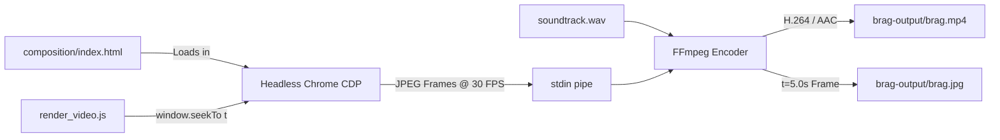

<div align="center">

# 🎬 iWriteTech — Official Launch Video

**A 20-second cinematic launch video for [iWriteTech](https://iwritetech.com), engineered using the [`latent-spaces/brag`](https://github.com/latent-spaces/brag) motion graphics framework.**

[-gold?style=for-the-badge&logo=youtube&logoColor=white)](brag-output/brag.mp4)
[](brag-output/brag.mp4)
[](brag-output/brag.mp4)
[](brag-output/work/soundtrack.wav)
[](https://github.com/latent-spaces/brag)

<br/>

[](brag-output/brag.mp4)

<br/>

**[▶ Watch Video (`brag.mp4`)](brag-output/brag.mp4)** &nbsp;•&nbsp; **[📋 Storyboard Plan](brag-output/brag-plan.md)** &nbsp;•&nbsp; **[🎨 Web Composition](brag-output/composition/index.html)** &nbsp;•&nbsp; **[✍️ Social Copy](brag-output/share-copy.txt)**

</div>

---

## 📖 Overview

**[iWriteTech](https://iwritetech.com)** is an independent editorial publication dedicated to aesthetic, minimal desk tech — keyboards, clean workspace accessories, and developer setups.

This repository houses the complete production suite for its official launch video:
- **Zero-filler storytelling:** Crafted strictly according to `/brag` creative laws (15–25s duration, hook in first 2 seconds, no generic SaaS jargon).
- **Authentic editorial visual identity:** Utilizes the real warm cream (`#F4EFE6`) and obsidian (`#0E0D0C`) palettes, serif typography (`Literata`), and authentic high-resolution photography.
- **Dedicated audio synthesis engine:** Built-in Python sound design engine that produces a 48kHz stereo master track synced down to the millisecond with visual cues.
- **Headless Chrome rendering pipeline:** Captures deterministic 1080p frames at 30 FPS through Chrome DevTools Protocol (CDP) piped directly into FFmpeg.

---

## ⏱️ Storyboard & Beat Breakdown

The video follows the 5-beat launch narrative structure designed in [`brag-output/brag-plan.md`](brag-output/brag-plan.md):

```
Hook (0-3s) ──▶ Reveal (3-7s) ──▶ The Product (7-11s) ──▶ The Experience (11-15s) ──▶ The Outro (15-20s)
```

| Timestamp | Beat | Visual Choreography | Audio & Sound Design |
|---|---|---|---|
| **0.0s – 3.0s** | **The Hook** | Pitch-black void (`#000000`) with a breathing golden radial glow. Golden serif typography eases in: <br/>*“Still scrolling Amazon for desk tech?”* | Deep D minor 9th warm ambient synthesizer pad fades in with analog filter sweep. |
| **3.0s – 7.0s** | **The Reveal** | Cut to warm cream canvas (`#F4EFE6`). The `iWriteTech` signature mark and tagline appear: <br/>*“Tech that looks as good as it performs.”*<br/>Slide-up stats: `100% Hands-On Tested · 100% Editorially Independent · 11 Categories`. | Panning stereo whoosh resolving into bright F major 7th chord. Tactile mechanical switch click on badge settlement. |
| **7.0s – 11.0s** | **The Product** | Editorial feature section: *“Every gadget, handpicked and tested.”* Category pills (`Desk Setups`, `Keyboards`, `MacBook`, `Gaming`) slide in with an authentic editorial setup card. | Rhythmic chord shift to Bb major 9th with soft spatial motion accents. |
| **11.0s – 15.0s** | **The Experience** | Split-screen morph showcasing Light Mode vs. Dark Mode reading experiences. Gold laser divider animates downward. Floating headline: <br/>*“Beautiful to read. Beautiful to browse.”* | Smooth modulation to G minor 7th; tactile theme toggle pop effect. |
| **15.0s – 20.0s** | **The Outro** | Deep obsidian canvas (`#0E0D0C`) with floating gold particles. Golden `iWriteTech` emblem pulses with divider line, primary domain `iwritetech.com`, and final signoff: <br/>*“Curated · Tested · Aesthetic.”* | D suspended chord resolving to D major with smooth reverb decay fading out at 20.0s. |

---

## 🎨 Visual Identity & Design System

The video's visual design mirrors the production frontend of **iWriteTech**:

```
Background (Light)  #F4EFE6  ████████  Warm Cream
Background (Dark)   #0E0D0C  ████████  Obsidian Black
Accent Gold (Dark)  #C9A66B  ████████  Champagne Gold
Accent Gold (Light) #866432  ████████  Deep Bronze Gold
Border / Card       #E4DDCE  ████████  Muted Sand
```

- **Headings:** [Literata](https://fonts.google.com/specimen/Literata) (Editorial Serif, 500/600/700 weight)
- **Body:** [Geist Sans](https://vercel.com/font) (Clean modern sans-serif)
- **Metrics & Meta:** [Geist Mono](https://vercel.com/font) (Tabular developer monospace)
- **Photography:** Authentic desk setup and mechanical keyboard review assets bundled under [`brag-output/composition/images/`](brag-output/composition/images/).

---

## 🔊 Sound Design & Audio Architecture

The soundtrack is procedurally synthesized using `NumPy` and `SciPy` (`brag-output/work/generate_soundtrack.py`), ensuring zero external royalty entanglements:

- **Multi-Oscillator Pads:** Detuned sawtooth and sine wave clusters filtered through 4th-order lowpass Butterworth filters (cutoff: 1200 Hz).
- **Sub-Bass Foundation:** Sine sub-oscillators tracking root notes (49 Hz to 87 Hz) with soft envelope shaping.
- **Cinematic Transitions:** Procedural bandpass-filtered noise sweeps (200 Hz – 1800 Hz) with dynamic stereo panning.
- **Tactile UI SFX:** Modeled mechanical keyboard switch clicks (1400 Hz & 2800 Hz transient bursts with exponential decay).
- **Mastering:** Peak normalized to -1.5 dB headroom with soft-knee limiting.

---

## ⚙️ Automated Rendering Engine

The video rendering pipeline bypasses browser recording frame drops by stepping through time deterministically:



### Key Technical Advantages
1. **Deterministic Timing:** Every frame is rendered after verifying `document.fonts.ready` and advancing CSS animations via Web Animations API (`document.getAnimations()`).
2. **Zero-Disk Streaming:** Captured JPEG frames are streamed straight from memory into FFmpeg's `image2pipe` demuxer, eliminating intermediate disk writes.
3. **Optimized Compression:** Encoded with `libx264` (CRF 18, medium preset, yuv420p) and `aac` (192 kbps), yielding a high-fidelity 1080p video at just **1.5 MB**.

---

## 📦 Deliverables & File Manifest

| File | Type | Resolution / Spec | Description |
|---|---|---|---|
| **[`brag-output/brag.mp4`](brag-output/brag.mp4)** | Video | 1920×1080, 30fps, 1.5 MB | Official final launch video file |
| **[`brag-output/brag.jpg`](brag-output/brag.jpg)** | Image | 1920×1080 JPEG | Settled thumbnail / poster frame |
| **[`brag-output/brag-poster.png`](brag-output/brag-poster.png)** | Image | 1920×1080 PNG | Uncompressed lossless poster frame |
| **[`brag-output/brag-plan.md`](brag-output/brag-plan.md)** | Document | Markdown | Storyboard, creative rationale & tone definition |
| **[`brag-output/share-copy.txt`](brag-output/share-copy.txt)** | Text | Plaintext | Ready-to-publish social launch copy |
| **[`brag-output/render_video.js`](brag-output/render_video.js)** | Script | Node.js | Automated CDP + FFmpeg rendering engine |
| **[`brag-output/composition/`](brag-output/composition/)** | Source | HTML5, CSS3, Images | Complete web motion graphics source code |
| **[`brag-output/work/generate_soundtrack.py`](brag-output/work/generate_soundtrack.py)** | Script | Python 3 | Procedural audio synthesis script |
| **[`brag-output/work/soundtrack.wav`](brag-output/work/soundtrack.wav)** | Audio | 48kHz, 16-bit Stereo PCM | Master uncompressed soundtrack |

---

## ✍️ Social Share Copy

Ready to post on Twitter / X, LinkedIn, or Product Hunt:

```text
We built a home for desk tech that doesn't look like every other blog. iWriteTech curates, tests, and reviews aesthetic gadgets — keyboards, setups, MacBook accessories — so you get the good stuff without the Amazon doomscroll.

iwritetech.com
```

---

## 🚀 How to Reproduce & Render Locally

### Prerequisites

Ensure the following tools are installed:
- [Google Chrome](https://www.google.com/chrome/)
- [Node.js](https://nodejs.org/) (v18 or higher)
- [FFmpeg](https://ffmpeg.org/) (with `libx264` and `aac` enabled)
- [Python 3](https://www.python.org/) with `numpy` and `scipy`:
  ```bash
  pip install numpy scipy
  ```

### Build Steps

1. **Clone the repository:**
   ```bash
   git clone https://github.com/MdKasif0/iWriteTech-Video.git
   cd iWriteTech-Video
   ```

2. **Generate the audio soundtrack:**
   ```bash
   python3 brag-output/work/generate_soundtrack.py
   ```

3. **Render the 1080p MP4 launch video:**
   ```bash
   node brag-output/render_video.js
   ```

The script will launch headless Chrome, seek each frame, pipe image data directly into FFmpeg, and export `brag-output/brag.mp4` and `brag-output/brag.jpg` in ~25–30 seconds.

---

## 📜 Credits & Acknowledgments

- **Creative Framework:** Inspired by the **[`latent-spaces/brag`](https://github.com/latent-spaces/brag)** launch video methodology by [Latent Spaces](https://github.com/latent-spaces).
- **Target Publication:** [iWriteTech](https://iwritetech.com) — *Curated. Tested. Aesthetic.*
