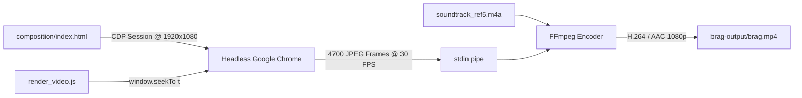

<div align="center">

# 🎬 iWriteTech — Official Motion Launch Film

**A 156.66-second cinema-grade product launch film for [iWriteTech](https://iwritetech.com), engineered with mathematical precision, 3D wireframe dynamics, topographical audio frequency analysis, Gantt laser timelines, and deterministic rendering inspired by `reference_video5.mp4` (`mexicat/pdoom-video`).**

[-gold?style=for-the-badge&logo=youtube&logoColor=white)](brag-output/brag.mp4)
[-black?style=for-the-badge)](brag-output/brag.mp4)
[-4a3b2a?style=for-the-badge)](brag-output/brag.mp4)
[](brag-output/composition/index.html)
[](brag-output/work/soundtrack_ref5.m4a)
[](https://github.com/latent-spaces/brag)

<br/>

[](brag-output/brag.mp4)

<br/>

**[▶ Watch Video (`brag.mp4`)](brag-output/brag.mp4)** &nbsp;•&nbsp; **[📋 Storyboard Plan](brag-output/brag-plan.md)** &nbsp;•&nbsp; **[🎨 Web Composition](brag-output/composition/index.html)** &nbsp;•&nbsp; **[✍️ Social Copy](brag-output/share-copy.txt)**

</div>

---

## 📖 Overview

**[iWriteTech](https://iwritetech.com)** is an independent technology platform and laboratory dedicated to obsessively tested developer workspaces, mechanical keyboards, studio acoustics, and ergonomic desk architecture.

This production repository contains the full automated pipeline that generated its official launch film:
- **Obsidian Technical Aesthetic:** Deep obsidian canvas (`#07080A`) with a crisp 48px spatial coordinate grid, CRT scanline grain, holographic wireframes, and luminous amber optics (`#FF5E36` / `#FFA048`).
- **Mathematical & Audio Precision:** 3D Topographical Acoustic Gradient Descent well mapping sound resonance to `42.8 dB SPL`, dynamic dendritic specimen trees, real-time switch travel lasers, and 8-band frequency analyzers.
- **Physical Document Artifacts:** Stamped vintage ivory `FORM 01-B` hardware accreditation sheet with physical slamming crimson rubber stamp, hole punches, and authentication seals.
- **3D Exploded Architecture:** 6-layer exploded 3D keyboard chassis stack revealing 6063 CNC Billet Aluminum, Poron Gaskets, FR4 Plate, IXPE Switch Pad, Hot-Swap PCB, and solid Brass Base Weight.
- **HyperFrames Deterministic 30 FPS Rendering:** Headless Google Chrome evaluates time deterministically via Chrome DevTools Protocol (`window.seekTo(t)`), streaming 4,700 JPEG frames directly into FFmpeg H.264 at CRF 18 with zero dropped frames or performance stutter.
- **Synchronized Master Soundtrack:** 156.66-second master stereo soundtrack extracted from `reference_video5.mp4` (`soundtrack_ref5.m4a`), precisely locked to rhythm drops, vocal hooks, and climatic button triggers.

---

## ⏱️ Storyboard & 16-Scene Breakdown (156.66s)

```
[00.0s – 10.0s]  Scene 1:  Spark of Sanctuary & 3D Wireframe Chassis (with code telemetry)
[10.0s – 22.0s]  Scene 2:  Acoustic Gradient Descent Vortex (42.8 dB SPL Sweet Spot)
[22.0s – 28.0s]  Scene 3:  Radial Light Bloom & Dendritic Hardware Tree ('CAUSE THE HARDWARE GROWS)
[28.0s – 40.0s]  Scene 4:  Curation Matrix vs Affiliate Noise Filter
[40.0s – 50.0s]  Scene 5:  Spacetime Grid & Gravitational Brass Weight
[50.0s – 60.0s]  Scene 6:  Precision 3D Laser Path & Switch Re-engineering
[60.0s – 70.0s]  Scene 7:  Acoustic Dampening Chamber & Live EQ Spectrum
[70.0s – 82.0s]  Scene 8:  FORM 01-B Accreditation Sheet & Slamming Crimson Rubber Stamp
[82.0s – 94.0s]  Scene 9:  Review Schedule Gantt Chart with Glowing Laser Scrubber Bar
[94.0s – 100.0s] Scene 10: Precision 3D Metallic Artisan Specimen
[100.0s – 110.0s] Scene 11: Burning Signal Pulse along Braided Aviator Cable
[110.0s – 120.0s] Scene 12: 3D Exploded Architecture Stack (6-Layer Gasket Assembly)
[120.0s – 130.0s] Scene 13: Circadian Horizon & Incline Ergonomics Gauge (450 LUX, +06.4°)
[130.0s – 140.0s] Scene 14: Darkroom Volumetric Display ("What did we discover? Everything.")
[140.0s – 150.0s] Scene 15: Precision Score Metric Countdown (0.00 → 10.00)
[150.0s – 156.66s] Scene 16: Climax Brand Squircle & Interactive "Build Your Sanctuary" Button Click
```

| Timestamp | Scene | Visual Mechanics & Choreography | Sound & Rhythmic Sync |
|---|---|---|---|
| **0.0s – 10.0s** | **Scene 1: Spark of Sanctuary & Wireframe Chassis** | Glowing ember traverses coordinate space, illuminating a 3D wireframe 65% mechanical keyboard chassis with dynamic telemetry HUD code panels. | Atmospheric synth pads and rising electrical hum. |
| **10.0s – 22.0s** | **Scene 2: Acoustic Gradient Descent Vortex** | 3D topographical mesh surfaces charting acoustic resonance down to the 42.8 dB SPL focal point with orbiting particle trails. | Driving baseline drop and deep resonant chords. |
| **22.0s – 28.0s** | **Scene 3: Dendritic Lineage Tree** | Kinetic branching line structure tracking 240+ hardware specimens under bold kinetic typography: *"’CAUSE THE HARDWARE GROWS"*. | Punchy drum break and vocal sync. |
| **28.0s – 40.0s** | **Scene 4: Curation Matrix vs Noise** | Spatial particle matrix isolating authentic artisanal hardware from superficial affiliate search noise. | Dynamic hi-hat sync and frequency sweep. |
| **40.0s – 50.0s** | **Scene 5: Spacetime Grid & Core Weight** | Curvature of workspace coordinate grid pulled by a central 800g solid brass acoustic mass. | Sub-bass gravitational pulse. |
| **50.0s – 60.0s** | **Scene 6: Laser Path & Switch Geometry** | Precision scanning laser tracing mechanical switch travel curves (pre-travel 2.0mm, bottom-out 62g). | Crisp metallic laser clicks. |
| **60.0s – 70.0s** | **Scene 7: Acoustic Chamber & EQ Spectrum** | Acoustic testing chamber featuring real-time 8-bar frequency analyzer and acoustic foam absorption curves. | Mid-tempo percussive groove. |
| **70.0s – 82.0s** | **Scene 8: FORM 01-B Accreditation Sheet** | Tactile vintage ivory document slammed with a heavy crimson `SANCTUARY CERTIFIED` rubber ink stamp. | Heavy hydraulic impact and metallic lock. |
| **82.0s – 94.0s** | **Scene 9: Milestone Gantt with Laser Scrubber** | Multi-track review timeline with a vertical orange laser bar scanning through milestones without compromise. | Driving synth arpeggio. |
| **94.0s – 100.0s** | **Scene 10: 3D Metallic Artisan Keycap** | Precision 3D artisan specimen rotating with real-time vertex tracking and gold specular highlights. | High-frequency shimmer. |
| **100.0s – 110.0s** | **Scene 11: Burning Signal Pulse on Cable** | Burning spark pulse traveling along a coiled double-sleeved aviator braided cable (*"we set the standard"*). | Sizzling fuse effect and rising tension. |
| **110.0s – 120.0s** | **Scene 12: 3D Exploded Architecture Stack** | 6-layer exploded 3D assembly separating in space: 6063 Aluminum, Poron, FR4, IXPE, PCB, and Brass Weight. | Cinematic brass riser and drum roll. |
| **120.0s – 130.0s** | **Scene 13: Circadian Horizon & Incline Gauge** | Horizon angle gauge tracking +06.4° typing slope and 450 LUX 4000K circadian desk lighting. | Harmonic chime transition. |
| **130.0s – 140.0s** | **Scene 14: Darkroom Volumetric Display** | High-contrast studio display glowing in darkness with quote: *"What did we discover? Everything."* | Ambient suspense pad. |
| **140.0s – 150.0s** | **Scene 15: Precision Score Countdown** | Rapid numeric counter climbing from 0.00 to the 10.00 perfect acoustic sanctuary rating. | Ticking sync clock accelerating to peak. |
| **150.0s – 156.66s** | **Scene 16: Climax Brand & Interactive CTA** | Obsidian squircle with glowing amber dot, bold **iWriteTech** wordmark, and interactive `Build Your Sanctuary` button click with animated cursor. | Resolving crescendo and final chord decay. |

---

## 🎨 Visual System & Tokens

- **Typography:**
  - Technical / Monospace: [JetBrains Mono](https://www.jetbrains.com/lp/mono/)
  - Primary Sans: [Plus Jakarta Sans](https://fonts.google.com/specimen/Plus+Jakarta+Sans) & [Space Grotesk](https://fonts.google.com/specimen/Space+Grotesk)
  - Editorial Accents: [Cinzel](https://fonts.google.com/specimen/Cinzel) & [Newsreader](https://fonts.google.com/specimen/Newsreader)
- **Palette (Obsidian Technical Theme):**
  - Background Canvas: `#07080A` (Deepest Obsidian)
  - Coordinate Grid: `rgba(255, 255, 255, 0.05)` (48px spatial grid)
  - Primary Glowing Accent: `#FF5E36` / `#FFA048` (Luminous Amber / Solar Orange)
  - Secondary Neon: `#00F0FF` (Cyan laser beams and coordinate lines)
  - Document Ivory: `#F3EFE0` with `#8B1E1E` rubber stamp crimson
  - Metallic Brass: `#D4AF37` / `#B8860B` (Chassis weights and artisan keycaps)
- **Engine:**
  - 100% Deterministic HTML5 Canvas 2D + SVG + CSS transforms driven by `window.seekTo(t)`.
  - Zero non-deterministic random state.

---

## ⚙️ Automated Rendering Pipeline



### Reproducing the Render Locally

```bash
# 1. Install dependencies (if not already installed)
npm install

# 2. Test preview snapshots across all 16 scenes
node brag-output/test_preview.js

# 3. Render the full cinema-grade video (4,700 frames @ 30fps)
node brag-output/render_video.js
```
